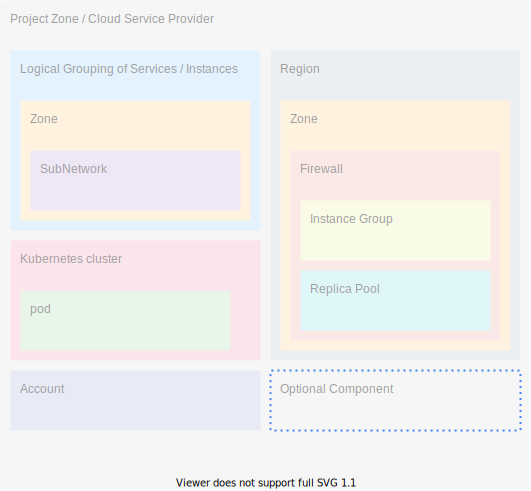

<!-- markdownlint-disable MD041 -->
- sorry. Japanese only.
<!-- markdownlint-enable MD041 -->

## 開発者向け - Development
1. [ドキュメント編集手順](./development/document_editing_procedure.md)
1. 規約
    1. 全般
    1. markdown
    1. TypeScript
    1. SQL
1. GitHub or GitLab 運用手順
    1. <GreenBadge text="T.B.D." />
1. tools
    1. [Visual Studio Code](./development/tools/VisualStudioCode.md)(VSCode)

## 要件定義 - Requirement definition
1. ::: details ODSC
    1. 目的 - Objective
        1. <GreenBadge text="T.B.D." />
    1. 成果物 - Deliverables
        1. <GreenBadge text="T.B.D." />
    1. 成功基準 - Success Criteria
        1. <GreenBadge text="T.B.D." />
    :::
1. 機能要件とか非機能要件とか

## 設計 - Design
### 外部 - External
1. システム構成図
    ::: details draw.ioで書けるサンプル
    
    :::
1. ユースケース
    1. <GreenBadge text="T.B.D." />

### 内部 - Internal
1. ER図
    1. [サンプル](./internal/er/sample.md)
1. [テーブル一覧](./internal/list_tables.md)
1. 画面一覧

## 【Tag List】
<TagList />
